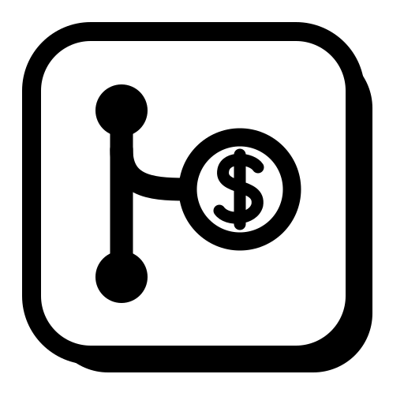
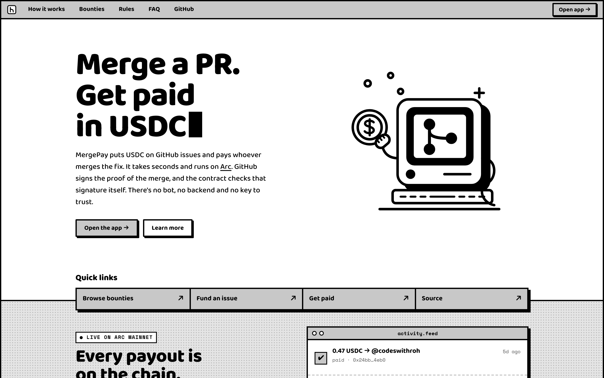
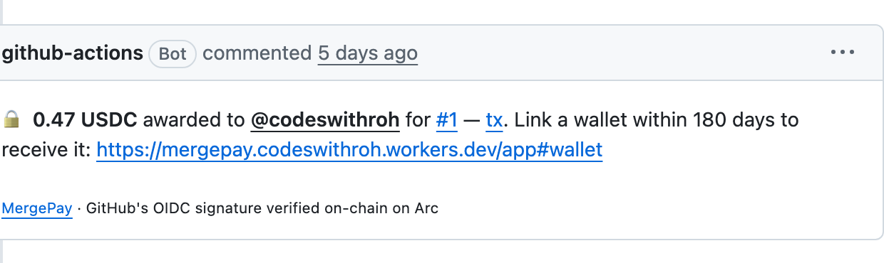
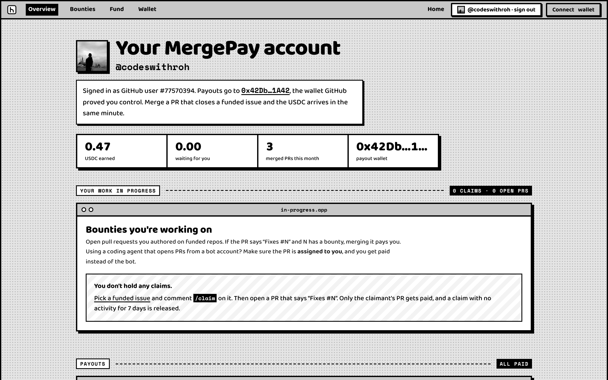
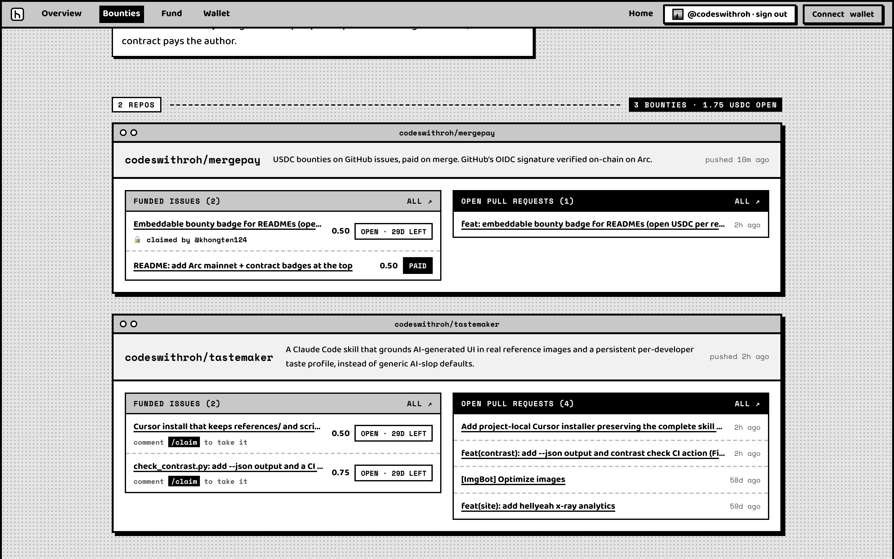
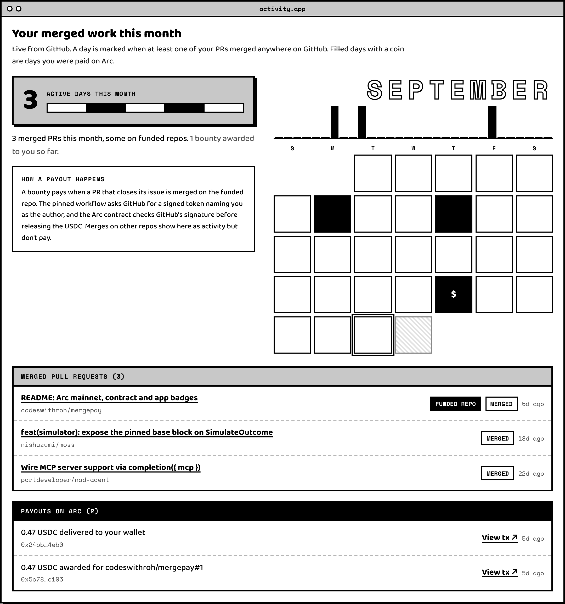
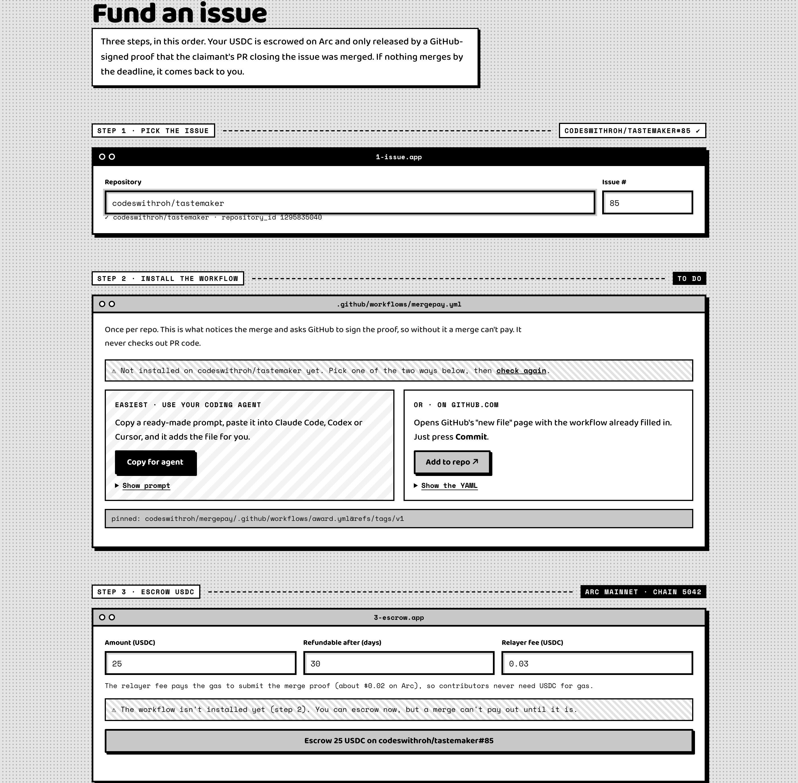
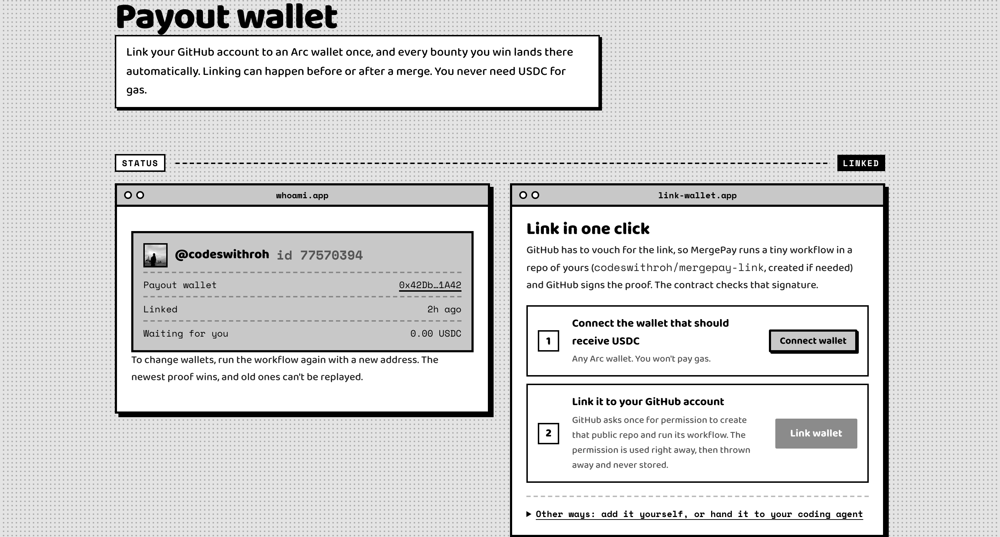
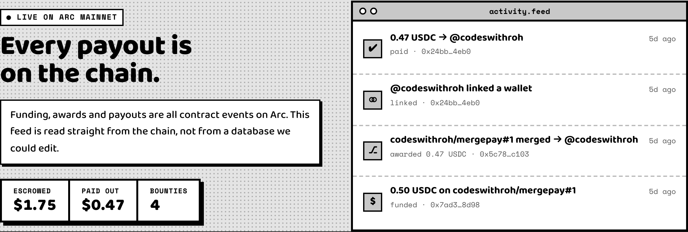
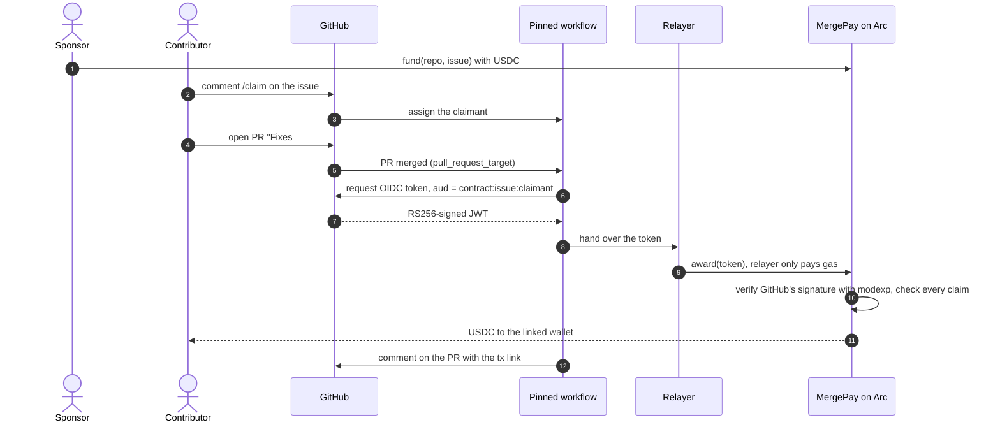

<div align="center">
  

  <h1>MergePay</h1>

  <p><b>Every merged pull request gets paid, instantly and without a middleman.</b></p>

  <p>
    <a href="https://explorer.arc.io/address/0xcff79B144833b36ca53b310C1Ad7854AF9Ff9EeD"></a>
    <a href="https://explorer.arc.io/address/0xcff79B144833b36ca53b310C1Ad7854AF9Ff9EeD"></a>
    <a href="https://mergepay.codeswithroh.workers.dev"></a>
    <a href="contracts/test/MergePay.t.sol"></a>
    <a href="LICENSE"></a>
  </p>

  <p>
    <a href="https://mergepay.codeswithroh.workers.dev"><b>Live app</b></a> ·
    <a href="#see-it-work">See it work</a> ·
    <a href="#how-it-works">How it works</a> ·
    <a href="#why-arc">Why Arc</a> ·
    <a href="#quick-start">Quick start</a> ·
    <a href="#what-you-have-to-trust">Trust model</a> ·
    <a href="#run-it-locally">Run locally</a>
  </p>

  
</div>

<br>

Open source runs the world, and the people who build it mostly work for free. Bounty platforms try to fix that, but each one puts a person or a server in the middle to check the merge, decide who wrote it and send the money.

MergePay removes the middle. Anyone escrows USDC on a GitHub issue. When a pull request that fixes it is merged, GitHub itself signs a token saying who merged what, and a contract on [Arc](https://arc.io) verifies GitHub's RSA signature on-chain before paying the author. The whole trip from merge to paid takes about 10 seconds.

## See it work

This happened on Arc mainnet with a real GitHub token. [Issue #1](https://github.com/codeswithroh/mergepay/issues/1) was funded and claimed, [PR #2](https://github.com/codeswithroh/mergepay/pull/2) merged at 07:56:18, and this comment appeared 10 seconds later:

<p align="center"></p>

- Funding tx: [`0x7ad3…8d98`](https://explorer.arc.io/tx/0x7ad3f4745211d9349d60e3f5205943a16ec29c59e379404bf464fab8c9e08d98)
- Award tx, with GitHub's signature verified on-chain: [`0x5c78…c103`](https://explorer.arc.io/tx/0x5c78366c49509523444fe8e815abcbf6ea9b3b583253c7ca4a3112d3b509c103)
- Payout tx, delivered when the wallet was linked: [`0x24bb…4eb0`](https://explorer.arc.io/tx/0x24bb35a217cf4102f51acd74f82bbee6a7cdad7e597e0810f7b5cc920f594eb0)

More bounties are open right now in the [app](https://mergepay.codeswithroh.workers.dev/app#bounties), including two on [tastemaker](https://github.com/codeswithroh/tastemaker).

## Features

- **Fund any public issue** with USDC from any wallet. It sits in the contract, and each funder can take their share back if nothing merges before the deadline.
- **`/claim` an issue** so only one contributor's PR can be paid. A claim with no activity for 7 days is released automatically.
- **Paid seconds after the merge**, with a comment on the PR linking the transaction.
- **One-click wallet link.** Connect a wallet, press Link, and GitHub signs the proof. Contributors never need USDC for gas.
- **Built for coding agents.** If a bot account opens the PR, the human it's assigned to gets paid. Every setup step has a "Copy for agent" prompt for Claude Code or Codex.
- **A personal dashboard** after signing in with GitHub, showing USDC earned, claims, a payout pipeline and a month of merged work.
- **A live activity feed** read from contract events, not from a database anyone can edit.

<table>
  <tr>
    <td width="50%"><br><sub><b>Dashboard.</b> Earnings, payout wallet and work in progress.</sub></td>
    <td width="50%"><br><sub><b>Bounties.</b> Funded issues beside each repo's open PRs, with claim status.</sub></td>
  </tr>
  <tr>
    <td><br><sub><b>Activity.</b> Merged PRs this month, with paid days marked in the calendar.</sub></td>
    <td><br><sub><b>Fund.</b> Paste an issue URL, install the workflow if needed, escrow USDC.</sub></td>
  </tr>
  <tr>
    <td><br><sub><b>Wallet.</b> Link once, and every future bounty lands automatically.</sub></td>
    <td><br><sub><b>Live feed.</b> Funding, awards and payouts straight from Arc.</sub></td>
  </tr>
</table>

## How it works



1. **Fund.** `fund(repoId, issue, repoName, workflowRef, expiry, relayerFee)` escrows native USDC. Bounties are keyed by GitHub's numeric `repository_id`, which survives renames. `workflowRef` pins the exact workflow version allowed to award the bounty.
2. **Claim.** [`claims.yml`](.github/workflows/claims.yml) handles `/claim` and `/unclaim`, allows one claim per person per repo, warns PRs from non-claimants, and releases claims idle for 7 days. A claim is simply the issue's assignee, so maintainers can also assign by hand.
3. **Award.** On merge, [`award.yml`](.github/workflows/award.yml) requests a GitHub OIDC token only for the issue's claimant. [`MergePay.sol`](contracts/src/MergePay.sol) checks the RS256 signature against GitHub's registered key, then checks `iss`, `exp`, `event_name`, `repository_id`, the pinned `job_workflow_ref`, and an audience that binds this contract, the issue and the recipient.
4. **Link.** A contributor proves "GitHub user #id controls wallet 0x…" through a signed token from a `workflow_dispatch` run in a repo they own. The contract requires `actor_id == repository_owner_id`, so nobody else's repo can speak for them, and a newer `iat` so an old link can't be replayed. The app does this in one click.

The relayer ([`app/src/worker.ts`](app/src/worker.ts)) splits the JWT, simulates the call and pays gas. It can't change who gets paid, because every field that matters is inside GitHub's signature. Anyone can run one.

## Why Arc

| Arc property | What it gives MergePay |
| --- | --- |
| USDC is the gas token | The bounty, the relayer fee and the payout are one asset. A contributor with an empty wallet still gets paid. |
| Sub-second finality | The "paid" comment on the PR is a final receipt, not a pending transaction. |
| `modexp` and `sha256` precompiles | Verifying GitHub's 2048-bit RSA signature costs about 660,000 gas, roughly 1.3 cents, so every payout can be checked. |
| Fees priced in dollars | Sponsors set a flat relayer fee in USDC, 3 cents by default, and never think about gas. |

## Quick start

### Maintainers and sponsors
1. Open the [Fund tab](https://mergepay.codeswithroh.workers.dev/app#fund) and paste an issue URL.
2. If the repo doesn't have MergePay yet, press **Add to repo** or **Copy for agent**. It's one workflow file:
   ```yaml
   # .github/workflows/mergepay.yml, full version in examples/mergepay.yml
   jobs:
     award:
       uses: codeswithroh/mergepay/.github/workflows/award.yml@v1
     claims:
       uses: codeswithroh/mergepay/.github/workflows/claims.yml@v1
   ```
3. Escrow USDC. Contributors comment `/claim`, you merge as usual, and payouts happen on their own.

### Contributors
1. Find a bounty on the [Bounties tab](https://mergepay.codeswithroh.workers.dev/app#bounties) and comment `/claim` on the issue.
2. Open a PR that says `Fixes #N`. If a coding agent opens it from a bot account, assign the PR to yourself.
3. [Link a wallet](https://mergepay.codeswithroh.workers.dev/app#wallet) once, before or after the merge. Awards wait in the contract for 180 days.

## What you have to trust

- **GitHub's signing keys.** The keys registered at deploy are in the constructor calldata, and anyone can check them against [GitHub's JWKS](https://token.actions.githubusercontent.com/.well-known/jwks). A new key has to be announced with `proposeSigningKey` and waits `KEY_DELAY` (3 days) before anyone can activate it. While a key change is pending, funders can refund open bounties early. Revoking a key is immediate, since it can't move funds.
- **Maintainers' merge decisions.** Whoever can merge decides whose fix is accepted, as in any open source project. The pinned workflow keeps *how* the recipient is chosen public and fixed.
- **Nothing else.** The relayer only pays gas. The website's GitHub sign-in only controls who sees a dashboard, and the one-click link only presses buttons on GitHub for you. GitHub does the vouching.

### Security details

- **Claim parsing.** [`JsonClaims.sol`](contracts/src/lib/JsonClaims.sol) matches the literal `"key":"`. Quotes inside a JSON string are always escaped, so the pattern can't match inside a value, and values containing `\` are rejected. A test covers a branch name that tries to smuggle a second `aud`.
- **Algorithm confusion.** Only `RS256` is accepted, with RSA moduli and e = 65537.
- **`pull_request_target`.** The award workflow never checks out PR code, and PR text only reaches the job through `env:`.
- **Agents.** The payout address never comes from PR text, so a prompt-injected agent can't redirect money.
- **Unclaimed awards.** After 180 days without a linked wallet, `returnUnclaimed` sends the payout back to funders, split by what each put in.
- **Tests.** 30 Foundry tests cover forged, tampered, replayed and mis-addressed tokens, the key time-lock, claims and refunds.

## Built with

- **Contracts.** Solidity 0.8.30 and Foundry, with hand-written Base64url, JSON-claim and RSA-PKCS#1 libraries on Arc's precompiles.
- **Workflows.** Reusable GitHub Actions workflows using GitHub's OIDC tokens.
- **App and relayer.** One Cloudflare Worker serving the site, relaying proofs, indexing events into KV, and handling GitHub sign-in. The frontend is plain HTML and viem with no build step.

```
contracts/   MergePay.sol, Base64Url / JsonClaims / RsaSha256 libs, 30 tests, deploy scripts
.github/     reusable award.yml, claims.yml and link.yml workflows
examples/    the files maintainers and contributors copy
app/         Cloudflare Worker: relayer API, event indexer, GitHub sign-in, web app
brand/       logo
docs/        screenshots
```

## Run it locally

```bash
# contracts
cd contracts && forge test -vv            # 30 tests
node scripts/gen-fixtures.mjs             # regenerate the signed test tokens

# local end-to-end: anvil + worker + GitHub-shaped tokens through the relayer
anvil --chain-id 5042 &
cd app && npm i && node scripts/e2e-local.mjs          # deploys, prints the next command
npx wrangler dev --var CONTRACT:0x... --var RPC_URL:http://127.0.0.1:8545
CONTRACT=0x... node scripts/e2e-local.mjs

# mainnet
cd contracts && node scripts/fetch-jwks.mjs
OWNER=0x... forge script script/Deploy.s.sol --tc Deploy --rpc-url arc --broadcast --account <keystore>
cd ../app && npx wrangler secret put RELAYER_KEY && npx wrangler deploy
```

## Roadmap

- [x] On-chain verification of GitHub OIDC tokens on Arc mainnet
- [x] Claims with `/claim`, a 7-day inactivity release, and returns after 180 days
- [x] Payouts for PRs opened by coding-agent bots
- [x] Sign in with GitHub and one-click wallet linking
- [ ] Time-locked multisig as contract owner
- [ ] Embeddable README badge showing a repo's open bounties ([#3](https://github.com/codeswithroh/mergepay/issues/3), funded)
- [ ] Passkey wallets created at link time, so contributors never see a seed phrase
- [ ] GitLab support, which issues the same kind of signed CI tokens

## Contributing

MergePay pays for its own issues. Pick a funded one in the [app](https://mergepay.codeswithroh.workers.dev/app#bounties), comment `/claim`, and open a PR that says `Fixes #N`. See [CONTRIBUTING.md](CONTRIBUTING.md) for the rest.

## License

[MIT](LICENSE)
